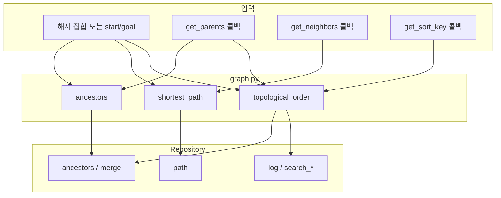
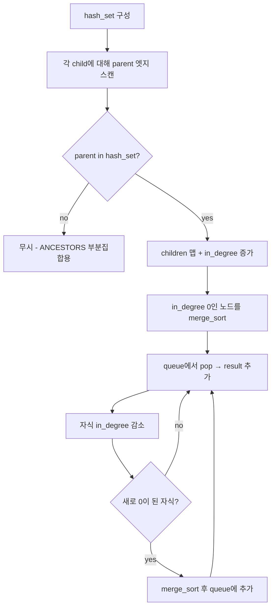
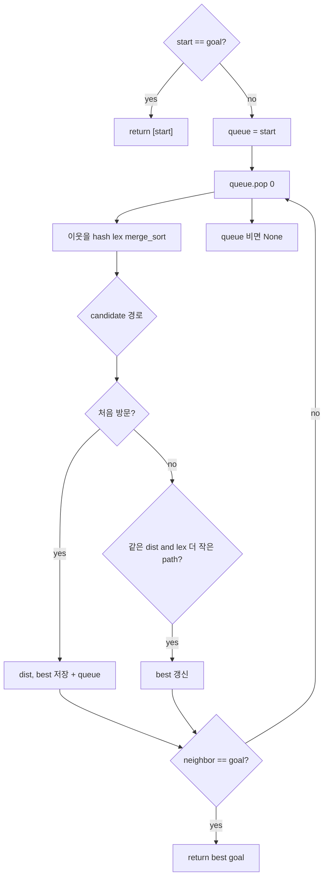
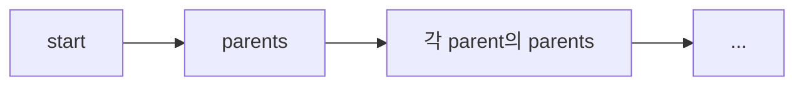

# `graph.py` 알고리즘 구조

[`mini_git/graph.py`](../mini_git/graph.py)는 커밋 DAG를 다루는 **순수 함수** 모음입니다. 저장소 상태(`Repository`)나 I/O에 의존하지 않고, 해시 문자열과 콜백(`get_parents`, `get_neighbors`)만 받습니다.

| 함수 | CLI / Repository 용도 | 그래프 방향 |
|------|----------------------|-------------|
| `topological_order` | `LOG`, `SEARCH`, `ANCESTORS` 출력 순서 | 부모 → 자식 (시간 순 느낌) |
| `shortest_path` | `PATH` | 무방향 (부모·자식 모두 이웃) |
| `ancestors` | `ANCESTORS` 집합, `merge` up-to-date 판별 | 자식 → 부모만 |
| `_path_key` | `shortest_path` 동률 비교용 (내부) | — |

공통 의존: 동률 정렬에 [`merge_sort`](../mini_git/sort.py)를 사용해 **결정적(deterministic)** 출력을 보장합니다.

---

## 모듈 전체 흐름



---

## 1. `topological_order`

### 목적

주어진 해시 **부분집합** 안에서 **모든 부모가 자식보다 앞에** 오도록 정렬합니다. 과제 `LOG`의 “최신순이 아니라 부모 선행” 규칙을 구현합니다.

### 시그니처

```python
topological_order(
    hashes: Iterable[str],
    get_parents: Callable[[str], Iterable[str]],
    get_sort_key: Callable[[str], Any],
) -> list[str]
```

| 인자 | 역할 |
|------|------|
| `hashes` | 정렬 대상 커밋 해시들 (전체 저장소 또는 검색 결과 등) |
| `get_parents` | 해시 → 부모 해시 목록 (`Commit.parents`) |
| `get_sort_key` | 같은 “준비 레벨”에서 누구를 먼저 꺼낼지 (보통 `(timestamp, hash)`) |

### 알고리즘: Kahn (위상 정렬)

**방향:** 엣지를 `parent → child`로 본 뒤, in-degree가 0인 노드(부모가 집합 안에 없거나 이미 출력된 노드)부터 꺼냅니다.



#### 단계별 코드 대응

1. **전처리 (22–30행)**  
   - `hash_set`: 입력 해시만 대상.  
   - `children[parent]`: 집합 **내부** parent→child 인접 리스트.  
   - `in_degree[child]`: 집합 안 부모 개수.  
   - `parent not in hash_set`이면 엣지 무시 → `ANCESTORS`처럼 일부 노드만 넣어도 동작.

2. **초기 큐 (32–33행)**  
   - in-degree 0 = 루트이거나, 부모가 집합 밖인 노드.  
   - `merge_sort(ready, key=get_sort_key)`로 동률 처리.

3. **메인 루프 (36–45행)**  
   - `queue.pop(0)`: FIFO (BFS형 위상 순회).  
   - 자식 in-degree를 1씩 줄이고, 0이 되면 `newly_ready`에 모음.  
   - 새로 준비된 노드도 `merge_sort` 후 `queue.extend`.

4. **반환**  
   - `result`: 부모 선행 순서의 해시 리스트.

### Repository에서의 사용

[`Repository._topo_commits`](../mini_git/repository.py)가 모든 `LOG` / `SEARCH` / `ANCESTORS` 출력 순서를 통일합니다.

```python
get_sort_key=lambda h: (self._commits[h].timestamp, h)
```

동일 `timestamp`면 `hash` 사전순으로 tie-break.

### 예시 (다이아몬드)

```
    0000001
   /       \
0000002   0000003
   \       /
    0000004
```

`get_sort_key = (timestamp, hash)`일 때 결과:  
`0000001 → 0000002 → 0000003 → 0000004`

---

## 2. `shortest_path`

### 목적

`start`에서 `goal`까지 **간선 수가 최소**인 경로를 찾고, 최단 경로가 여러 개면 **경로 문자열이 사전순으로 가장 작은** 해시 열을 반환합니다. (`PATH` 명령, 과제 §4.5)

### 시그니처

```python
shortest_path(
    start: str,
    goal: str,
    get_neighbors: Callable[[str], Iterable[str]],
) -> list[str] | None
```

그래프는 **무방향**으로 취급합니다. Repository는 이웃을 `parents + _children`으로 제공합니다.

### 알고리즘: BFS + 최단 거리 갱신 + 사전순 경로



#### 상태 변수

| 변수 | 의미 |
|------|------|
| `dist[v]` | `start`에서 `v`까지 최단 거리 |
| `best[v]` | `start`에서 `v`까지의 **현재까지 최선** 경로 (해시 리스트) |
| `queue` | BFS 프론티어 (FIFO) |

#### 동률 규칙 (`_path_key`)

같은 길이의 최단 경로가 두 개 이상이면, 경로를 `"->".join(path)` 문자열로 붙여 **문자열 사전순**이 작은 쪽을 선택합니다.

```python
# 예: 0000001 -> 0000002 -> 0000004  vs  0000001 -> 0000003 -> 0000004
# "0000001->0000002->0000004" < "0000001->0000003->0000004"  → 전자 선택
```

이웃 탐색 순서도 `merge_sort(..., key=lambda h: h)`로 해시 오름차순을 보장합니다.

#### 특수 케이스

- `start == goal` → `[start]` (거리 0).  
- 도달 불가 → `None` (`PATH` → `No path`).

### Repository에서의 사용

```python
def neighbors(commit_hash: str) -> list[str]:
    commit = self._commits[commit_hash]
    return list(commit.parents) + self._children.get(commit_hash, [])
```

부모 링크만으로는 “자식 방향” 탐색이 안 되므로 `_children` 인덱스가 PATH에 필요합니다.

---

## 3. `ancestors`

### 목적

`start`에서 **부모 방향**으로만 따라가며 도달 가능한 모든 조상 해시를 **집합**으로 반환합니다. **`start` 자신은 포함하지 않습니다.** (`ANCESTORS`, `merge`의 “Already up to date”)

### 시그니처

```python
ancestors(
    start: str,
    get_parents: Callable[[str], Iterable[str]],
) -> set[str]
```

반환은 **순서 없음**. 출력 순서는 Repository가 `graph_ancestors` 결과에 `topological_order`를 다시 적용합니다.

### 알고리즘: BFS (부모 방향)



#### 상태 변수

| 변수 | 역할 |
|------|------|
| `visited` | 이미 큐에서 처리한 해시 (중복 방문 방지) |
| `queue` | 아직 펼치지 않은 frontier |
| `found` | 조상으로 확정된 해시 (`start` 제외) |

#### 단계

1. `visited = {start}`, `queue = list(get_parents(start))`.  
2. `queue.pop(0)`으로 노드를 꺼냄.  
3. 이미 `visited`면 스킵.  
4. 아니면 `visited`·`found`에 추가.  
5. 그 노드의 부모 중 `visited`에 없는 것을 `queue`에 append.  
6. merge 커밋처럼 부모가 둘이어도 `0000001`은 한 번만 `found`에 들어감.

### Repository에서의 사용

| 호출처 | 용도 |
|--------|------|
| `Repository.ancestors` | 조상 집합 → `_topo_commits`로 정렬 후 출력 |
| `Repository.merge` | `target_head in graph_ancestors(current_head, ...)` 이면 up-to-date |

---

## 4. `_path_key` (비공개)

```python
def _path_key(path: list[str]) -> str:
    return "->".join(path)
```

`shortest_path` 전용. CLI 출력 형식(`" -> ".join`)과는 다르게, **비교용**으로 `->`만 사용합니다. 동일 최단 길이 후보 경로의 사전순 tie-break에만 쓰입니다.

---

## 함수 비교 요약

| | `topological_order` | `shortest_path` | `ancestors` |
|--|---------------------|-----------------|-------------|
| 그래프 | 방향: parent→child (부분집합) | 무방향 | 방향: child→parent |
| 알고리즘 | Kahn 위상 정렬 | BFS | BFS |
| 큐 정렬 | `merge_sort` + `get_sort_key` | 이웃 `merge_sort` by hash | 없음 (순서 무관) |
| 반환 | 순서 있는 `list[str]` | 최단 경로 또는 `None` | 순서 없는 `set[str]` |
| start 포함 | 해당 없음 | goal까지 경로에 포함 | **제외** |

---

## 복잡도 (대략)

`n` = 입력 해시 수, `m` = 집합 내부 parent 엣지 수, `V`/`E` = BFS 방문 노드·간선.

| 함수 | 시간 | 비고 |
|------|------|------|
| `topological_order` | O((n + m) log n) | 큐마다 `merge_sort` |
| `shortest_path` | O(V · (E log V)) | 이웃 정렬 + 경로 리스트 복사 |
| `ancestors` | O(V + E) | 집합 연산 O(1) 가정 |

과제 규모(메모리 내 소규모 DAG)에서는 단순 구현으로 충분합니다.

---

## 테스트 매핑

[`tests/test_graph.py`](../tests/test_graph.py)에서 각 함수의 핵심 계약을 검증합니다.

| 테스트 | 검증 내용 |
|--------|-----------|
| `TestTopologicalOrder.test_chain` | 선형 체인 부모 선행 |
| `test_diamond` | merge 다이아몬드 + timestamp tie |
| `test_subgraph_ignores_external_parent` | 부분집합 입력 |
| `test_deterministic_ties` | 동일 key 시 hash lex |
| `TestShortestPath.test_chain_shortest` | 무방향 최단 경로 |
| `test_diamond_lex_tie` | 동일 길이 lex-min 경로 |
| `test_no_path_disconnected` | `None` |
| `TestAncestors.*` | 조상 수집, self 제외, merge 중복 제거 |

---

## 관련 문서

- 과제 요구: [`docs/subject.md`](subject.md) §4.5  
- 설계 결정: [`docs/plan.md`](plan.md) §6  
- 디버깅 시나리오: [`docs/debug_commands.md`](debug_commands.md) §3.2–3.3  
- 학습용 개요: [`docs/study_guide.md`](study_guide.md) §10–12
